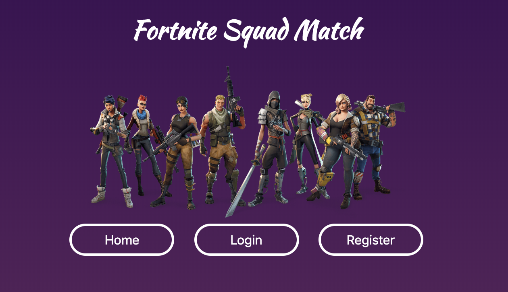
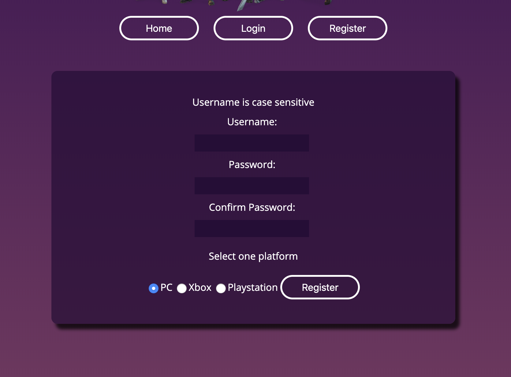
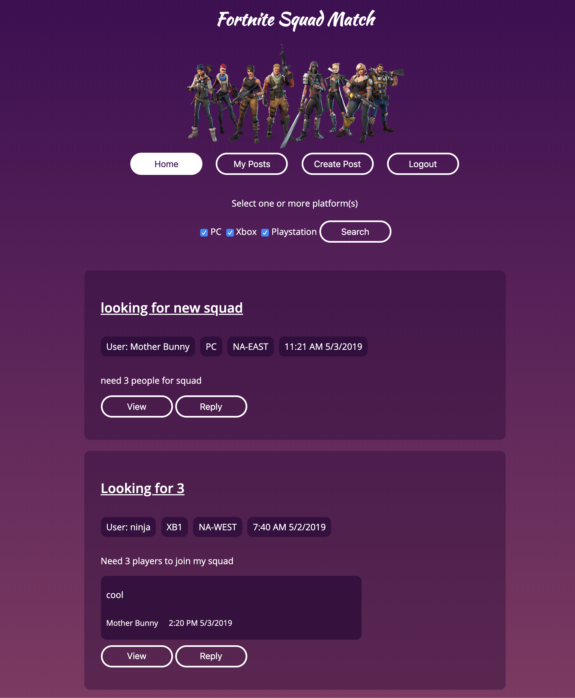
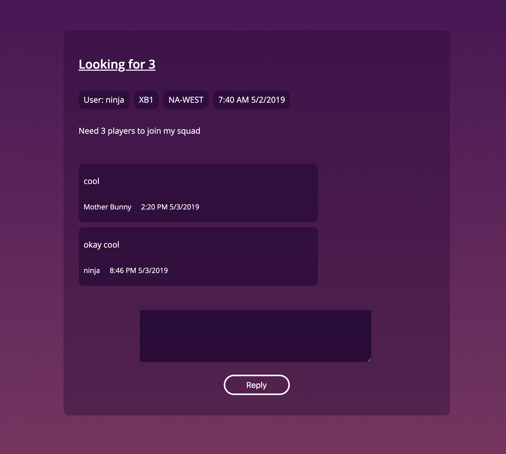
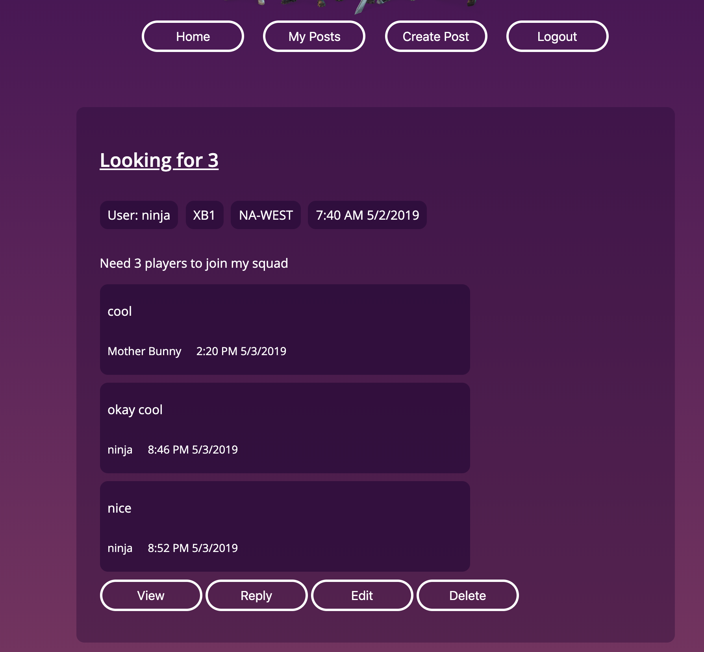
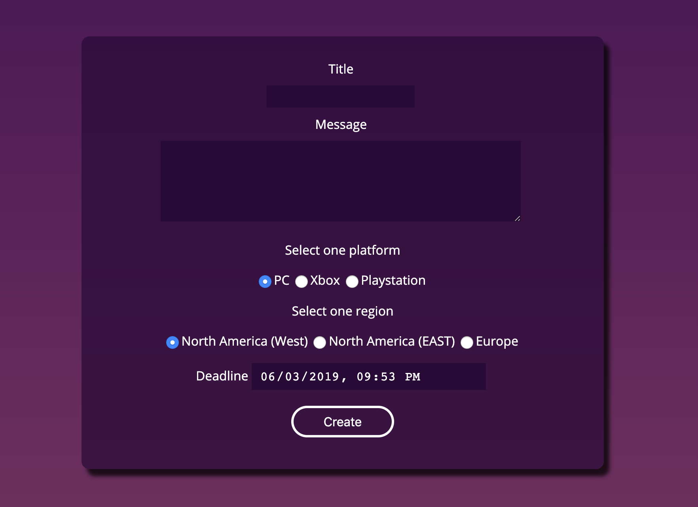

# Fortnite Squad Finder

## About the app

The application will allow users to find other Fortnite players to play with

https://fierce-tundra-18202.herokuapp.com/

When the application loads for the first time, users will be able to see the existing posts made by other users in the database.



Users will have 3 options on the menu bar: Home, Login, and Register. The home button will show all the posts but will be different if you are logged in. Both the login and register buttons will take you to respective forms that make POST requests to the API. If you are a logged in, you will be able to reply to the posts and you will have access to the my posts page as well.
If you click Home, it will reload the home page.
If you click Login you will be directed to this form:


If you click on Register, you will be directed to this form:



The register form will allow you to create a new user in the database.
But the user must be a valid Epic Games username. (examples: ninja, tfue)
This is important as it validates that you are an actual fortnite player. In the future, users will be able to see the game stats of players and their match histories. The username validation is done with a call to an external API called FortniteTracker.
The login form will allow you to login and access the protected features of the app such as: creating posts, editing posts, adding replies to posts, and deleting posts.

You must register and then log in if you are a first time user. Once you are logged in the home screen will look like this:



Here you have an extra reply button to reply to posts as well as the view button to view posts.
The view button will show all the comments, whereas you can only see a few comments when looking at all the posts.
The reply button will take you to a page displaying the post and replies with a form to add a reply.



After you submit a reply you are redirected to the post you've replied to.
On my posts page you will be able to see all of the posts you've created. If you haven't created a post this will be empty.
From the my posts page you can: View, Reply, Edit, or Delete any of your posts.



The Create Post button allows users to create a post.



The log out button will delete your session and redirect you to the original home page that users who are not logged in initially see.

## API Documentation

### GET All Posts

```
url: '/api/posts/'
type: 'GET',
headers: {
      Authorization: `Bearer ${localStorage.getItem("token")}` <--- (Optional)
    }
```

This method gets all the posts in the database and does not require user to be logged in.

### GET Post by ID

```
url: '/api/posts/:id/'
type: 'GET',
```

Any post can be retreived using this method whether the user is logged in or not.

### GET My Posts

```
url: '/api/posts/my-posts/'
type: 'GET',
headers: {
      Authorization: `Bearer ${localStorage.getItem("token")}` <--- (Required)
    }
```

If a user is logged in, they can retrieve all of the posts they made using this method.
An authorization header is required to access this endpoint. Only the user who created the posts will be able to access this page.

### POST Show Posts by Platform

```
url: '/api/posts/:id/'
type: 'POST',
data: JSON.stringify({ platforms })
```

Retreive posts by platform by posting which platforms you're searching for.
Platforms must be an array that contains one or more of the following options: `['pc','xb1','psn']`

### POST Register Request

```
url: '/api/users/'
type: 'POST',
data: JSON.stringify({ username, password, platform }),
contentType: "application/json"
```

Registering users requires 3 things: username, password, platform

Username

- Must be an existing username in the Epic Games network
- Usernames are case sensitive
- Some users may not be able to sign up if their Epic Games username has already been claimed
- Client will receive a validation error if the username is already taken

Password

- Minimum 8 characters
- Maximum 72 characters

Platform

- This API currently supports 3 platforms: PC, Xbox, and Playstation
- Users should choose the platform that they created their Epic Games Account with
- Users will be allowed to make posts for different platforms after registering, they just need one main platform assigned to their profile

This data will all be sent to an external API called FortniteTracker that keeps Epic user statistics and validates that the user name is an Epic username.

### POST Login Request

```
url: '/api/auth/login'
type: 'POST',
data: JSON.stringify({ username, password }),
contentType: "application/json"
```

A login request takes a username and password and returns a valid authentication token. The API uses Passport.js to authenticate user data. The username and password must be correct in order to receive the token. Each authorization token lasts 7 days. After the 7 days the user will be logged out and redirected back to the login page to create a new token.
After the method you will want to set the authorization token in the client. You can use something like this:

```
localStorage.setItem("token", data.authToken)
```

### POST Post Request

```
url: '/api/posts/'
type: 'POST',
data: JSON.stringify({ postName, platform, region, deadline, message }),
contentType: "application/json"
headers: {
      Authorization: `Bearer ${localStorage.getItem("token")}` <---- (Required)
    }
```

A post request creates a new post in the database.

- postName: Must be a string (required)
- platform: `'pc','xb1','psn'` (required)
- region: `'na-east','na-west','eu'` (required)
- deadline: Date must be > now (required)
- message: String (required)
- user: This comes from the token that you must provide in the headers after creating a user account

### DELETE Post Request

```
url: '/api/posts/my-posts/:id'
type: 'POST',
data: JSON.stringify({ _id: req.params.id }),
contentType: "application/json"
headers: {
      Authorization: `Bearer ${localStorage.getItem("token")}` <---- (Required)
    }
```

To delete a post you must have a valid token and you must pass a post id that belongs to the corresponding user. Users are only allowed to delete their own posts. You will not be able to delete the post if the user id on the token does not match the user id of the post given.

### PUT Post Request

```
url: '/api/posts/:id'
type: 'POST',
data: JSON.stringify({ id, postName, platform, region, deadline, message }),
contentType: "application/json"
headers: {
Authorization: `Bearer ${localStorage.getItem("token")}` <---- (Required)
}
```

Editing a post is similar to creating a post except that you must inlcude the id of the existing post you made. The existing post must also belong to the user that provides the token.

### PUT Reply Request

```
url: '/api/posts/reply/:id'
type: 'POST',
data: JSON.stringify({ reply }),
contentType: "application/json"
headers: {
Authorization: `Bearer ${localStorage.getItem("token")}` <---- (Required)
}
```

This method allows you to add replies to existing posts. You must be signed in but the post does not have to belong to you to add a reply. A reply consists of a datePosted (made automatically), a message, which must be a string and a user id, which is provided by the token.
